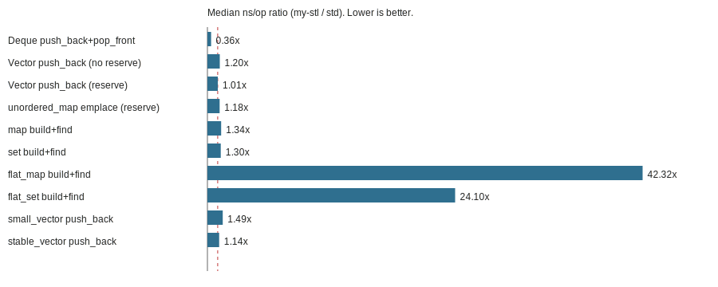

# Benchmarks

This report summarizes microbenchmarks that compare my-stl containers to their closest `std::` equivalents.
Each benchmark runs the same operation with the same input size and prints timing samples.

## Methodology

- Build type: `Release` (`-O3` for `stl_bench`)
- Warmup iterations: 1
- Sample iterations: 5
- Input size (`n`): 200000
- Reported metric: median nanoseconds per operation

## How to Reproduce

```bash
python3 scripts/bench/run.py --n 200000 --iters 5 --warmup 1
python3 scripts/bench/report.py --run docs/benchmarks/runs/bench-YYYYMMDD-HHMMSS.json
```

## Latest Run

Run file: `docs/benchmarks/runs/bench-20251219-132313-m2.json`

- Timestamp (UTC): 2025-12-19T18:23:13Z
- Machine: Apple M2, macOS 15.5
- Compiler: Apple clang 17.0.0
- Build: Release (`-O3`)

Summary (median ns/op; ratio = my-stl / std):

| Case | my-stl | std | Ratio |
| --- | --- | --- | --- |
| Deque push_back+pop_front | 1.831 | 5.155 | 0.355 |
| Vector push_back (no reserve) | 1.184 | 0.985 | 1.202 |
| Vector push_back (reserve) | 0.470 | 0.467 | 1.007 |
| unordered_map emplace (reserve) | 48.570 | 41.019 | 1.184 |
| map build+find | 316.520 | 236.631 | 1.338 |
| set build+find | 246.726 | 190.280 | 1.297 |
| flat_map build+find | 8675.880 | 204.992 | 42.323 |
| flat_set build+find | 4858.020 | 201.612 | 24.096 |
| small_vector push_back | 1.206 | 0.810 | 1.488 |
| stable_vector push_back | 16.427 | 14.426 | 1.139 |

See `docs/benchmarks/bench_summary.csv` for the full table.
The chart below shows the ratio (my-stl / std). Lower is better.



## Notes

- Microbenchmarks measure specific operations and can be sensitive to allocator, CPU scaling, and compiler flags.
- Use the scripts above to regenerate results on your hardware for accurate comparisons.
- `flat_map` and `flat_set` are compared to `std::map`/`std::set`, which are not direct equivalents; use the results as a directional reference only.
